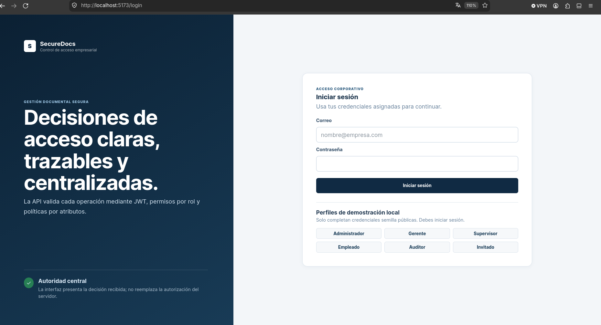
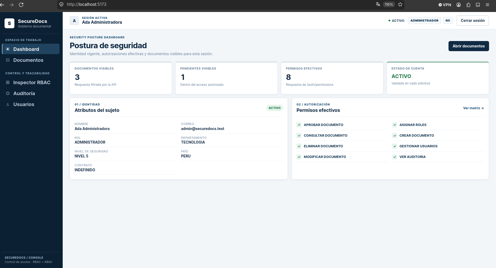
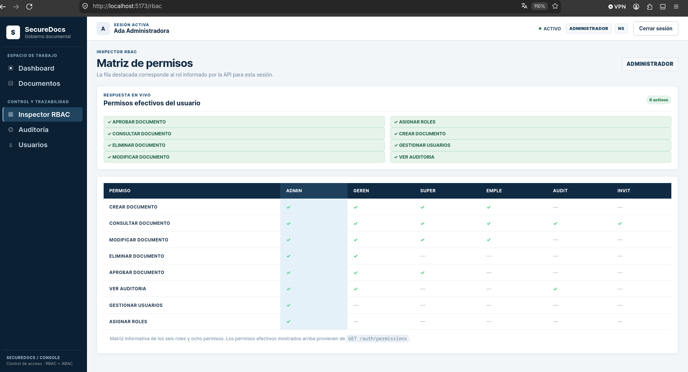
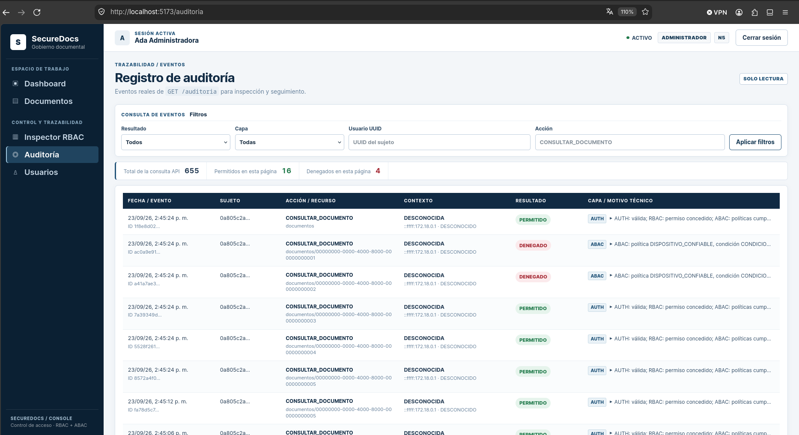

# SecureDocs

SecureDocs es el proyecto del laboratorio de Cloud Security. Incluye autenticación JWT, revocación persistida, RBAC y ABAC centralizados sobre PostgreSQL, CRUD y aprobación de documentos, auditoría de accesos y una interfaz React conectada a la API.

## Evidencias de funcionamiento



*Autenticación: valida las credenciales del usuario y establece una sesión segura mediante JWT.*



*Dashboard: resume los datos del usuario autenticado y las funciones disponibles según sus permisos.*



*Matriz RBAC: muestra la relación entre los roles del sistema y los permisos asignados a cada uno.*



*Auditoría: registra los accesos y permite distinguir las decisiones permitidas, denegadas o con error.*

## Tecnologías

- Node.js 22 o superior, TypeScript y Express 5.
- PostgreSQL 16.
- Prisma ORM, bcrypt, Zod, Helmet y CORS.
- Docker Compose para la base de datos local.
- React 19, Vite, TypeScript y React Router para la interfaz web.

## Estructura

```text
apps/
├── api/
│   ├── prisma/          # Esquema, migraciones y datos semilla
│   └── src/             # API Express, autenticación, usuarios y autorización
└── web/                 # Frontend React + Vite
docs/
└── architecture/        # Modelo y decisiones de arquitectura
docker-compose.yml       # PostgreSQL y servicios locales
```

## Instalación local

Requisitos: Node.js 22+, npm y Docker con el complemento Compose. Desde la raíz del repositorio, ejecuta en este orden:

1. Copia la configuración local de ejemplo. Sus valores son exclusivamente de desarrollo.

   ```bash
   cp .env.example .env
   ```

2. Inicia PostgreSQL y espera a que el healthcheck indique que está disponible.

   ```bash
   docker compose up -d postgres
   docker compose ps postgres
   ```

3. Instala las dependencias de la API.

   ```bash
   npm --prefix apps/api install
   ```

4. Aplica la migración versionada.

   ```bash
   npm --prefix apps/api run prisma:migrate
   ```

5. Carga los datos semilla. El comando es idempotente y puede repetirse.

   ```bash
   npm --prefix apps/api run prisma:seed
   ```

6. Instala las dependencias del frontend.

   ```bash
   npm --prefix apps/web install
   ```

7. Inicia la API y el frontend en terminales separadas.

   ```bash
   npm --prefix apps/api run dev
   npm --prefix apps/web run dev
   curl --fail http://localhost:3000/health
   ```

Abre `http://localhost:5173`. Una respuesta saludable de la API tiene código HTTP `200`, `status: "ok"` y `database: "connected"`. Si PostgreSQL no está accesible, el endpoint responde HTTP `503` y estado degradado.

También puedes iniciar los tres servicios con Docker Compose:

```bash
docker compose up
```

La API queda en `http://localhost:3000` y el frontend en `http://localhost:5173`. Docker conserva los bind mounts del código, pero instala las dependencias de cada aplicación en un volumen `node_modules` separado del host. La API genera Prisma Client dentro del contenedor Alpine. El primer arranque puede tardar mientras `npm ci` descarga los paquetes.

## Configuración y autenticación

`.env.example` contiene valores **exclusivos de desarrollo local**. Copia el archivo a `.env` y reemplaza `JWT_SECRET` por un secreto propio de al menos 32 caracteres antes de cualquier uso fuera del laboratorio. `.env` está ignorado por Git.

| Variable | Uso local |
| --- | --- |
| `DATABASE_URL` | Conexión PostgreSQL de la API local. |
| `POSTGRES_DB`, `POSTGRES_USER`, `POSTGRES_PASSWORD`, `POSTGRES_PORT` | Base local de Docker Compose. |
| `API_PORT` | Puerto HTTP; predeterminado `3000`. |
| `JWT_SECRET` | Clave de firma HS256; el valor de ejemplo es público y solo local. |
| `JWT_EXPIRES_IN` | Duración del JWT, por ejemplo `1h` (`s`, `m`, `h`, `d`). |
| `CORS_ORIGIN` | Único origen web permitido por CORS; ejemplo `http://localhost:5173`. |
| `DEMO_MODE` | `false` por defecto; habilita cabeceras de demostración solo fuera de producción. |
| `VITE_API_URL` | URL pública de la API consumida por el navegador; predeterminado `http://localhost:3000`. |
| `VITE_DEMO_MODE` | Muestra y activa controles locales de hora, ubicación y dispositivo cuando vale `true` durante desarrollo. |
| `WEB_PORT` | Puerto publicado por Docker Compose para el frontend; predeterminado `5173`. |

Todas las cuentas semilla usan `SecureDocs-Demo-Only-2026!`, **solo para desarrollo local**. Para probar el acceso, usa `admin@securedocs.test`; `inactivo@securedocs.test` y `suspendido@securedocs.test` sirven para comprobar el rechazo. Las demás cuentas figuran en el [modelo de datos](docs/architecture/database-model.md). Estas credenciales públicas no deben usarse en despliegues.

```bash
curl -sS -X POST http://localhost:3000/auth/login \
  -H 'Content-Type: application/json' \
  -d '{"correo":"admin@securedocs.test","password":"SecureDocs-Demo-Only-2026!"}'
```

El resultado contiene `accessToken`. Envíalo como `Authorization: Bearer <accessToken>` a `GET /auth/me`, `GET /auth/permissions`, `POST /auth/logout` y `/usuarios`. El frontend conserva ese JWT solamente en `sessionStorage`; un `401` limpia la sesión local y vuelve al login. Logout guarda el `jti` revocado en PostgreSQL: el mismo token devuelve `401` desde ese momento. `GET /auth/permissions` devuelve el rol y los códigos de permisos efectivos del usuario autenticado, consultados desde PostgreSQL.

## Usuarios

`GET /usuarios` lista usuarios; `POST /usuarios` crea uno; `PUT /usuarios/:id` actualiza campos enviados. Los tres endpoints exigen JWT válido y permisos RBAC actuales:

| Endpoint | Permisos requeridos |
| --- | --- |
| `GET /usuarios` | `GESTIONAR_USUARIOS` |
| `POST /usuarios` | `GESTIONAR_USUARIOS` y `ASIGNAR_ROLES` |
| `PUT /usuarios/:id` sin `rol` | `GESTIONAR_USUARIOS` |
| `PUT /usuarios/:id` con `rol` | `GESTIONAR_USUARIOS` y `ASIGNAR_ROLES` |

Si falta un permiso, la API devuelve HTTP `403` con `error.code: "RBAC_DENIED"` y `error.permisoFaltante`. Con las asignaciones semilla, solamente ADMINISTRADOR puede administrar usuarios. El cuerpo de creación requiere `nombre`, `correo`, `password`, `rol`, `departamento` (nombre o `null`), `nivelSeguridad`, `pais` (nombre de 2 a 80 letras, con espacios simples; se recortan los extremos y se convierte a mayúsculas, por ejemplo `PERU`), `tipoContrato` y `estado`. `PUT` acepta cualquier subconjunto no vacío de esos campos. La contraseña se almacena como hash bcrypt y nunca se devuelve.

Los valores de `rol` son `ADMINISTRADOR`, `GERENTE`, `SUPERVISOR`, `EMPLEADO`, `AUDITOR`, `INVITADO`; los departamentos semilla son `FINANZAS`, `RRHH`, `TECNOLOGIA`. `nivelSeguridad` admite `NIVEL_1` a `NIVEL_5`; `tipoContrato`, `INDEFINIDO`, `TEMPORAL`, `CONSULTOR`, `EXTERNO`; `estado`, `ACTIVO`, `INACTIVO`, `SUSPENDIDO`.

La [arquitectura RBAC](docs/architecture/rbac.md) contiene el flujo y la matriz completa de permisos. Los [escenarios RBAC](docs/testing/rbac.md) describen las respuestas y la evidencia.

## ABAC

`evaluateAbac(context)` evalúa usuario, documento, acción y entorno contra las ocho políticas activas de PostgreSQL. Las rutas llaman a `authorizeLoadedDocument` después de autenticar, verificar RBAC y cargar o construir el recurso. No existe un endpoint ABAC público. Consulta la [arquitectura ABAC](docs/architecture/abac.md) y el [flujo integrado](docs/architecture/authorization-flow.md).

## Documentos y auditoría

Todas las rutas siguientes requieren `Authorization: Bearer <accessToken>`. Un rechazo RBAC devuelve `403 RBAC_DENIED`; uno ABAC devuelve `403 ABAC_DENIED` con la política fallida. Cada intento queda auditado, incluidos rechazos de autenticación. Un ID inexistente devuelve `404` seguro.

| Endpoint | Permiso RBAC | Resultado |
| --- | --- | --- |
| `GET /documentos` | `CONSULTAR_DOCUMENTO` | Lista solo documentos autorizados; no expone metadatos denegados. |
| `GET /documentos/:id` | `CONSULTAR_DOCUMENTO` | Consulta un documento autorizado. |
| `POST /documentos` | `CREAR_DOCUMENTO` | Crea un documento `PENDIENTE` con propietario igual al usuario autenticado. |
| `PUT /documentos/:id` | `MODIFICAR_DOCUMENTO` | Modifica campos permitidos tras evaluar ABAC sobre el estado actual y el candidato. |
| `DELETE /documentos/:id` | `ELIMINAR_DOCUMENTO` | Elimina; devuelve `204`. |
| `POST /documentos/:id/aprobar` | `APROBAR_DOCUMENTO` | Cambia `PENDIENTE` a `PUBLICADO`. |
| `GET /auditoria` | `VER_AUDITORIA` | Consulta registros; no hay API de modificación ni eliminación. |

`GET /catalogos/departamentos` requiere un JWT válido y devuelve únicamente `id` y `nombre`. Cada intento se registra en la auditoría central con la acción `CONSULTAR_DEPARTAMENTOS` y el recurso `catalogos/departamentos`, incluidos los rechazos por token ausente o inválido. La interfaz lo usa para enviar el UUID correcto en formularios documentales.

`POST /documentos` exige `titulo`, `descripcion`, `departamentoId` (UUID), `nivelConfidencialidad` (`NIVEL_1` a `NIVEL_5`) y `pais` en mayúsculas, por ejemplo `PERU`. `PUT` acepta un subconjunto no vacío de esos campos. Zod rechaza campos adicionales como `propietarioId` y `estado`. La aprobación acepta un objeto JSON vacío. `GET /auditoria` admite filtros opcionales `resultado` (`PERMITIDO`, `DENEGADO`, `ERROR`), `usuario` (UUID), `accion`, `limite` (1–100, predeterminado 20) y `pagina` (1–10000, predeterminada 1); devuelve `auditorias`, `total`, `limite` y `pagina`.

Para desarrollo local, configura `DEMO_MODE=true`, `VITE_DEMO_MODE=true` y mantén `NODE_ENV=development`. Reinicia ambos servidores después de cambiar las variables. El frontend mostrará la franja `MODO DEMOSTRACIÓN - SOLO DESARROLLO LOCAL` y enviará `X-Demo-Hour`, `X-Demo-Location` y `X-Demo-Device`. La hora es de Lima (0–23); ubicación admite un nombre de país en mayúsculas y dispositivo solo `CORPORATIVO` o `PERSONAL`.

Los controles web solo existen cuando Vite ejecuta una compilación de desarrollo y `VITE_DEMO_MODE=true`. La API ignora siempre esas cabeceras cuando `NODE_ENV=production`; para que tengan efecto local, también necesita `DEMO_MODE=true`. La ubicación se muestra y registra como contexto, pero la política `PAIS_PERMITIDO` compara `usuario.pais` con `documento.pais` y no usa esa selección como sustituto. Fuera de `DEMO_MODE` se usan el reloj del servidor, la IP de Express y señales verificadas o desconocidas según el adaptador. Una señal de dispositivo desconocida deniega consultas de nivel 4 o 5.

## Scripts del frontend

Ejecuta desde la raíz con `npm --prefix apps/web run <script>`:

| Script | Uso |
| --- | --- |
| `dev` | Inicia Vite en `0.0.0.0:5173`. |
| `build` | Valida TypeScript y genera el bundle de producción. |
| `preview` | Sirve localmente el bundle generado. |

La interfaz ofrece login, resumen del usuario, documentos, gestión de usuarios, inspector RBAC y auditoría de solo lectura. Los botones operativos envían la solicitud a la API y muestran su resultado real. La ruta de documentos incluye una consulta por UUID para preparar capturas de casos permitidos o denegados sin simular el veredicto.

La [matriz de autorización](docs/testing/document-authorization.md) contiene los 17 escenarios HTTP y futuras evidencias.

## Scripts de la API

Ejecuta cada script desde la raíz con `npm --prefix apps/api run <script>`:

| Script | Uso |
| --- | --- |
| `dev` | Inicia la API en modo desarrollo y observa cambios. |
| `build` | Compila TypeScript en `apps/api/dist`. |
| `start` | Ejecuta la versión compilada. |
| `prisma:generate` | Regenera Prisma Client. |
| `prisma:migrate` | Aplica las migraciones pendientes con `prisma migrate deploy`. |
| `prisma:seed` | Carga o actualiza el catálogo y los datos demostrativos. |
| `test` | Ejecuta pruebas HTTP de autenticación, RBAC, ABAC, documentos y auditoría contra PostgreSQL local ya migrado y poblado. |

## Seguridad de los datos demostrativos

Todos los usuarios semilla usan la contraseña pública de prueba indicada arriba. El seed almacena únicamente su hash bcrypt.

El archivo `.env` está ignorado por Git. No agregues credenciales reales al repositorio; en entornos reales utiliza secretos gestionados y una contraseña distinta para PostgreSQL.

El modelo completo, las relaciones y las cuentas de prueba están documentados en [docs/architecture/database-model.md](docs/architecture/database-model.md).
Los escenarios de prueba están en [docs/testing/authentication.md](docs/testing/authentication.md).
