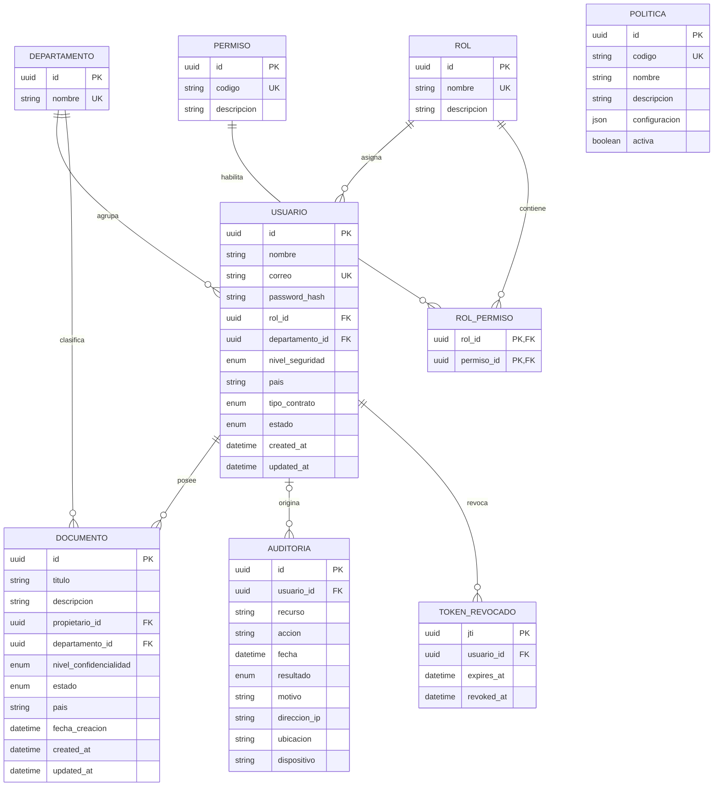

# Modelo de persistencia

## Diagrama entidad-relación

## Relaciones

- Cada usuario tiene un rol y puede pertenecer a un departamento. El departamento es opcional para permitir invitados externos.
- Los roles y permisos tienen una relación muchos-a-muchos explícita mediante `RolPermiso`, que conserva la asignación RBAC como dato auditable.
- Cada documento tiene un propietario y pertenece a un departamento. Su nivel de confidencialidad utiliza la misma escala de nivel 1 a 5 que el nivel de seguridad del usuario.
- Una auditoría puede vincularse a un usuario. La relación es opcional para conservar eventos técnicos o históricos aunque el actor no esté disponible.
- `TokenRevocado` guarda el identificador único (`jti`) de cada JWT cerrado, su usuario y su vencimiento. `authenticate` consulta esta tabla en cada solicitud protegida. No se almacena el JWT completo. Los registros vencidos pueden purgarse posteriormente usando el índice `expires_at`.
- Las políticas ABAC son un catálogo independiente con código, explicación, estado y configuración JSON. En esta etapa solo se persisten; su evaluación se implementará posteriormente.

## Catálogos semilla

Los roles son `ADMINISTRADOR`, `GERENTE`, `SUPERVISOR`, `EMPLEADO`, `AUDITOR` e `INVITADO`. Los permisos RBAC son:

1. `CREAR_DOCUMENTO`
2. `CONSULTAR_DOCUMENTO`
3. `MODIFICAR_DOCUMENTO`
4. `ELIMINAR_DOCUMENTO`
5. `APROBAR_DOCUMENTO`
6. `VER_AUDITORIA`
7. `GESTIONAR_USUARIOS`
8. `ASIGNAR_ROLES`

La matriz RBAC semilla contiene exactamente 24 asignaciones `RolPermiso`:

| Rol | Permisos |
| --- | --- |
| `ADMINISTRADOR` | Los 8 permisos del catálogo |
| `GERENTE` | `CREAR_DOCUMENTO`, `CONSULTAR_DOCUMENTO`, `MODIFICAR_DOCUMENTO`, `ELIMINAR_DOCUMENTO`, `APROBAR_DOCUMENTO`, `VER_AUDITORIA` |
| `SUPERVISOR` | `CREAR_DOCUMENTO`, `CONSULTAR_DOCUMENTO`, `MODIFICAR_DOCUMENTO`, `APROBAR_DOCUMENTO` |
| `EMPLEADO` | `CREAR_DOCUMENTO`, `CONSULTAR_DOCUMENTO`, `MODIFICAR_DOCUMENTO` |
| `AUDITOR` | `CONSULTAR_DOCUMENTO`, `VER_AUDITORIA` |
| `INVITADO` | `CONSULTAR_DOCUMENTO` |

Las ocho configuraciones ABAC activas son `NIVEL_SEGURIDAD`, `MISMO_DEPARTAMENTO`, `PAIS_PERMITIDO`, `HORARIO_LABORAL`, `DISPOSITIVO_CONFIABLE`, `INVITADO_RESTRINGIDO`, `PROPIETARIO_DOCUMENTO` y `USUARIO_ACTIVO`.

`INVITADO_RESTRINGIDO` aplica una conjunción: exige simultáneamente `usuario.tipoContrato == EXTERNO`, `documento.nivelConfidencialidad <= NIVEL_1` y `documento.estado == PUBLICADO`. `USUARIO_ACTIVO` permite únicamente el estado `ACTIVO` y deniega tanto `INACTIVO` como `SUSPENDIDO`.

El enum `EstadoUsuario` contiene `ACTIVO`, `INACTIVO` y `SUSPENDIDO`.

Los campos `pais` de usuarios y documentos guardan nombres normalizados en mayúsculas. Los usuarios y documentos de prueba de Perú usan `PERU`; la invitada externa usa `CHILE`.

## Usuarios de prueba

| Nombre | Correo | Rol | Departamento | País | Estado |
| --- | --- | --- | --- | --- | --- |
| Ada Administradora | `admin@securedocs.test` | ADMINISTRADOR | TECNOLOGIA | PERU | ACTIVO |
| Gabriela Gerente | `gerente@securedocs.test` | GERENTE | FINANZAS | PERU | ACTIVO |
| Sergio Supervisor | `supervisor@securedocs.test` | SUPERVISOR | RRHH | PERU | ACTIVO |
| Elena Empleada | `empleado@securedocs.test` | EMPLEADO | TECNOLOGIA | PERU | ACTIVO |
| Augusto Auditor | `auditor@securedocs.test` | AUDITOR | FINANZAS | PERU | ACTIVO |
| Ines Invitada | `invitado@securedocs.test` | INVITADO | TECNOLOGIA | PERU | ACTIVO |
| Ivan Inactivo | `inactivo@securedocs.test` | EMPLEADO | RRHH | PERU | INACTIVO |
| Externa Invitada | `externo@partner.test` | INVITADO | Sin departamento | CHILE | ACTIVO |
| Susana Suspendida | `suspendido@securedocs.test` | EMPLEADO | TECNOLOGIA | PERU | SUSPENDIDO |

Los cinco documentos de prueba (`Planilla mensual`, `Presupuesto anual`, `Guía de onboarding`, `Evaluaciones internas` y `Manual de herramientas`) tienen `pais = PERU`.

La contraseña común es `SecureDocs-Demo-Only-2026!`, exclusivamente para desarrollo local y nunca reutilizable en producción. Los hashes no se documentan ni se exponen.
